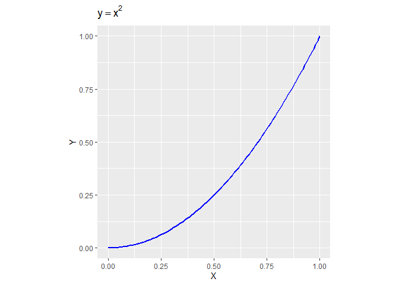
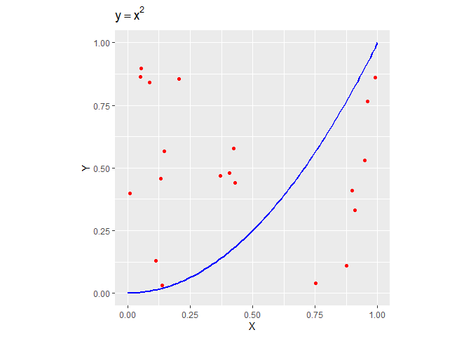
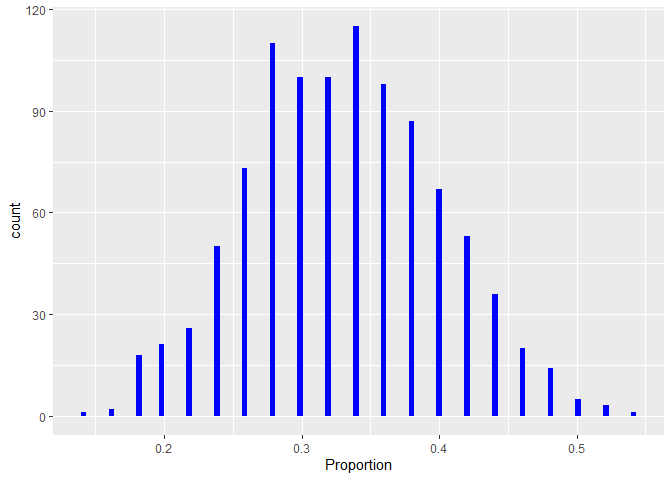

Simulação de Monte-Carlo: Integração
================
Eduardo Jacob
2020-05-15

## Problema:

Calcular o seguinte Integral (área sobre a curva), usando uma simulação
de “**Monte-Carlo**”

\[ {\color{Blue}\int_{0}^{1}x^{2} dx} \]



## Abordagem:

A abordagem ao problema consiste em gerar um conjunto de pontos
aleatórios sobre o quadrado unitário e contar qual a proporção de
pontos que vai calhar debaixo do gráfico da função:



A proporção de pontos vezes a área do quadrado (Area = 1) vai dar o
valor do Integral pretendido ( Estatisticamente falando )

\[ \left ( \frac{Pontos\: debaixo\: da\: curva }{Total\: de\: Pontos} \right ) \times Area\: do\: Quadrado= Valor\: do\: Integral \]

## Exemplo de Solução

Para efectuar esta simulação, vamos repetir a experiencia proposta N
vezes, e assim obter uma distribuição estatistica da proporção em causa
Implementando em linguagem de programação R, temos:

``` r
N = 50 # Numero de pontos 
E = 1000 # Numero de experiencias 
proportion = NULL
for ( i in 1:E ) { 
  X = runif(N)
  Y = runif(N)
  proportion = c(proportion,sum(Y < X^2) / N)
}
proportion = data.frame(Proportion=proportion)

ggplot(proportion) +
  aes(x = Proportion) +
  geom_histogram(bins = 100L, fill = "blue") +
  theme_gray()
```



## Conclusões

``` r
summary(proportion)
```

    ##    Proportion    
    ##  Min.   :0.1400  
    ##  1st Qu.:0.2800  
    ##  Median :0.3200  
    ##  Mean   :0.3303  
    ##  3rd Qu.:0.3800  
    ##  Max.   :0.5400

Vemos que a distribuição do Slide anterior se aproxima á curva “Normal”
e vemos que a média do Vector de proporções: mean(proportion) = 0.33026
é bem próximo da solução exacta de 1/3
